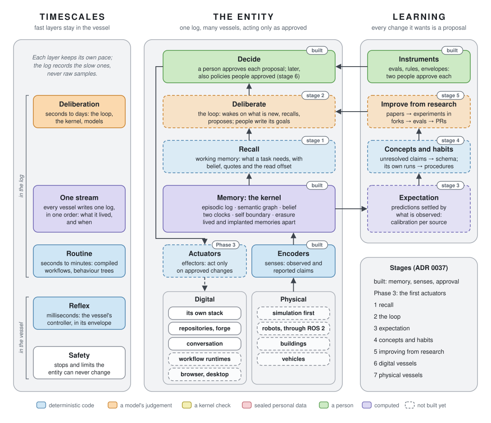

# 0037. Toward a cognitive model, in vessels digital and physical

Date: 2026-10-07 · Status: proposed (direction only: nothing here is built or stubbed; each
stage gets its own ADR and the owner's go-ahead; ADR 0035's order stands)

<picture>
  <source media="(prefers-color-scheme: dark)" srcset="../figures/trajectory-dark.svg">
  
</picture>

*Figure 2. Solid blocks are built, dashed ones are not; the tags name the stage below that
builds each one.*

## Context

ADR 0026 set the north star: a cognitive model that improves itself by reading new
research and testing techniques against its own evals. The owner asks what the road to it
looks like for a **persistent digital entity** that can be **embodied in vessels**, both
digital (systems, runtimes, channels) and physical (robots, buildings).

Much of a cognitive architecture already exists, under other names (the design doc's
table, "Toward self-maintenance"):
- **Episodic memory:** the log. What was sensed, from which source, in which order, at
  which offset.
- **Semantic memory:** the graph, its projection, with two clocks: when something was true
  and when the kernel learned it.
- **Epistemic judgement:** belief, computed from independent origins. Disagreements stay
  visible as contested.
- **Lived and implanted memories, kept apart:** basis (observed, reported, inferred),
  source and origin say whether something was sensed first-hand, told, or read in bulk.
- **Perception:** encoders, deterministic or model-driven (ADR 0036).
- **Procedural knowledge:** skills, packs, and processes mapped as told, written and done.
- **Executive control:** rule rejections, and the approval channel (ADR 0019, 0029).
- **A self-model:** the self boundary as claims (ADR 0017), its own stack observed, and
  drift between its declared and observed body (ADR 0028).
- **Forgetting by right:** sealing and erasure (ADR 0022). Consent is recorded as a claim
  (ADR 0036).

What is missing:
- **Working memory.** Nothing chooses what an agent sees of the kernel for a task.
- **A loop of its own.** The kernel answers when a harness calls; nothing wakes it.
- **Expectations it can be wrong about.** Nothing checks its predictions against what
  happens later.
- **Learning its own structure.** New concepts and habits are still written by people.
- **Bodies beyond its own stack.** There are no actuators yet, and no physical senses.

Two frames from prior work:
- **CoALA** (Sumers et al. 2023, arXiv:2309.02427) describes a language agent by its
  memories, its actions and its decision cycle:
  - memories: working, episodic, semantic and procedural;
  - internal actions: retrieval, reasoning and learning; external actions: grounding;
  - a decision cycle that proposes, evaluates, selects and executes.

  The kernel already provides the episodic and semantic memories and the selection step,
  which here is a person.
- **Robot architectures** split control into layers by timescale: reflexes, sequencing and
  deliberation (Gat's three-layer architectures, 1998; Brooks' subsumption, 1986).
  - Generative Agents (arXiv:2304.03442) shows a memory stream with reflection and retrieval.
  - Voyager (arXiv:2305.16291) shows a library of skills learned as code.
  - SayCan (arXiv:2204.01691) grounds a model's plans in what a body can do.

## Decision (proposed)

### The entity is its log

The entity's identity is one log, the data keys it holds and the packs it understands.
- **Models** are interpreters it uses. They can be replaced, and each is measured on the
  evals.
- **Vessels** are bodies it is attached to, and can be detached from.
- **What it knows** has a source. **What it did** has an approval.

### The kernel stays passive and small

Every invariant carries over unchanged:
- one write path;
- an append-only log;
- deterministic projection;
- belief as a pure function;
- no model inside the database;
- gated actuation.

The cognitive model is built around the kernel, never inside it. Recall, the loop,
learning, encoders and actuators are all clients of the gateway.

### Vessels

A vessel is a body the entity senses and acts through. Each has:
- **A pack** describing it: its parts, their states, and what each part can do.
- **Encoders,** its senses, paired with **actuators,** its effectors (ADR 0036's contracts).
- **An envelope:** what it may do without asking each time.
  - The envelope is a policy that people approve. It is an instrument, so two people
    approve it (ADR 0019's approval by policy).
  - Each action taken under it names the policy and the people who approved it.
  - Whether actions stayed inside their envelope is a query, as changes without approval
    are today.
- **Reflexes:** fast control that stays in the vessel.
- **A safety layer** below everything, which the entity cannot change at all: hardware
  stops, certified safety controllers, physical limits.

**Attaching a vessel is a self-boundary claim** (ADR 0017), so attaching one, or moving
between vessels, is a proposal that people approve. The entity can be in several vessels at
once. They all write one log, whose order is its one stream of experience.

**Digital vessels:**
- its own stack (observed today, with drift as proprioception);
- repositories through the forge (read today; pull requests are its hands later);
- workflow runtimes (Phase 3's first actuators);
- conversation channels (through harnesses today);
- a browser or a desktop.

**Physical vessels:**
- robots through ROS 2 (Apache-2.0);
- buildings through their control systems;
- vehicles.

### Three timescales

| Layer | Pace | Where it runs | What the log keeps |
| --- | --- | --- | --- |
| Deliberation | seconds to days | the loop, the kernel and models | everything it decides, with sources |
| Routine | seconds to minutes | workflows and behaviour trees compiled from the process representation, approved before they run | each run's events, read back as observed claims |
| Reflex | milliseconds | the vessel's own controller, inside its envelope | nothing: summaries only, and envelope breaches |
| Safety | always | hardware and certified controllers | nothing: out of the entity's reach |

- **The routine layer** is Phase 3's workflow adapter, generalised: a behaviour tree is one
  more runtime the process representation compiles to.
- **The kernel records events worth remembering,** never raw samples. Examples: it entered
  a room, it finished a task, a reading went out of range.
- **Raw streams** (video, audio, telemetry) stay in the vessel's recorder. A source refers to
  them by hash, uri and time span, as it refers to a document.

### Stages

Each stage is useful on its own and has a gate measured on evals. Each needs the one before
it:
- a loop without recall is blind;
- predictions need a loop to settle them;
- learning needs runs and predictions;
- improving from research needs learning and forks;
- a physical body needs all of it, plus safety.

| Stage | Adds | Built from | Gate |
| --- | --- | --- | --- |
| Built | memory with receipts: log, graph, belief, two clocks, sealing; encoders, decoders; the approval channel; a model of its own stack | Phases 1 to 3 | the invariant tests, replay, the evals |
| 1. Recall | working memory: the facts a task needs, with belief, contested sides, windows, quotes and the read offset; retrieval traces record what an agent was shown | the recall ADR already in scope | on held-out questions, answers with recall beat answers without it, and every sentence cites |
| 2. The loop | a runner that wakes on new log entries, schedules and vital signs, recalls, deliberates on a configured model, and writes claims and proposals through the gateway; its own deliberation is recorded as sources it wrote | the design doc's vital signs; ADR 0035's re-runs | weeks unattended over Northwind's re-runs and its own stack, with no invariant broken, and a stated share of its proposals approved |
| 3. Expectation | predictions (modality `predictive`, with a window) settled by what is later observed; calibration per agent, model, source and sense, as a query; trust (ADR 0011) earned from track records | belief, the two clocks | calibration on held-out predictions, with intervals |
| 4. Concepts and habits | unresolved claims clustered into proposed ontology changes; its own runs mined with `discover` and `conform` into procedures, compiled for a runtime and run in shadow | the design doc's concept and habit formation; the process pack | proposals people approve; shadow runs that match the model's path on held-out tasks |
| 5. Improving from research | papers from the daily arXiv stream become hypotheses; experiments run in forks (ADR 0018) against its evals; results become evidence on pull requests | the research pack, forks, the forge | one technique adopted this way that improves a held-out eval |
| 6. Digital vessels | vessels beyond its own stack; envelopes as approved policies | Phase 3's workflow adapter | each vessel's actions stay inside its envelope; drift between its declared and observed body is shown |
| 7. Physical vessels | a ROS 2 vessel, in simulation first (Gazebo or MuJoCo), then one real vessel in a controlled space | stages 1 to 6 | zero envelope breaches over a stated number of simulated hours; a safety review by qualified people; the bystander ADR accepted |

**Habit formation is the process product, turned inward.** `discover`, `rank` and the
workflow adapters a client pays for are the same tools the entity uses to find and compile
its own habits. So the paying path (ADR 0035) and this one share their code.

### What the kernel will need

Each change below gets its own ADR when its stage starts. They are listed here so that
none of them comes as a surprise.
- **Sources that are not text.** Audio, images, video and sensor recordings need quotes of
  their own kind: a time span or a region. A model's claim about a scene then points at
  what it saw, as a reported claim points at its words today.
- **One order of experience.** The append lock gives the entity one sequence of
  experience; keep it.
  - Encoders summarise rather than stream.
  - A vessel that outruns the log summarises more.
  - Sharding the log would split the entity.
- **The entity as an origin.** What it infers counts as one origin however often it repeats
  it, which belief v2 already does.
  - Consolidation (reflection, summaries of experience) writes inferred claims that cite
    what they summarise. They never replace the log.
- **Approval by policy** (ADR 0019) is built for envelopes, as instruments.
- **People it meets.** A vessel that sees or hears people records personal data.
  - Recording people needs their consent or another lawful basis, recorded as a claim, as
    intake records consent.
  - Bystanders stay unidentified and are sealed per session.
  - Raw recordings stay in the vessel, with a retention limit.
  - This needs its own ADR before any vessel records people.

### What does not follow

- **"Cognitive" names functions:** remembering, recalling, expecting, learning, acting.
  Nothing here claims the entity is conscious or a person.
- **"General" means general across domains and vessels.** The kernel's four node types and
  fixed edges stay; packs specialise them. Generality is measured by how well a new domain
  or vessel is learned (stage 4's proposals, the evals per pack), not by one benchmark.
- **The entity never approves** its own actions, its envelopes or its evals. More autonomy
  means wider envelopes that people approve, never a way around them.

## Consequences

**Nothing changes yet:**
- This ADR is proposed.
- CLAUDE.md's out-of-scope list stands: observer runs, concept formation, habit formation,
  and the cognitive model itself.
- ADR 0035's build order stands. Recall (stage 1) is already in scope as a proposed ADR,
  and the rest waits for the owner.
- CLAUDE.md and the README point to this ADR as the trajectory toward the north star.

**Each stage has a product:**

| Stage | Product |
| --- | --- |
| 1. Recall | agent memory with receipts |
| 2. The loop | recurring engagements |
| 3. Expectation | forecasts with track records |
| 4. Concepts and habits | automation found in the work itself |
| 6. Digital vessels | governed automation on a client's runtime |
| 7. Physical vessels | operations of facilities and robots with an audit trail |

**Risks:**
- **Approval load:** batched reviews and envelopes keep it manageable. A person still
  writes each envelope.
- **Gaming the evals:** instruments need two people and are never changed in the same
  proposal as what they judge.
- **Dependence on models:** models are replaceable, and evals are run per model.
- **Physical safety:** the safety layer stays outside the entity, a qualified review comes
  before any real vessel, and simulation comes first.
- **Privacy in physical spaces:** the bystander ADR comes before any recording.
- **Cost:** an always-on loop costs model calls. The vital signs' maintenance share bounds
  it.

**Figures:**
- Figure 1 (the README) shows the architecture as built.
- Figure 2 (above) shows this trajectory.
- Both are drawn by `docs/figures/figures.py`.
